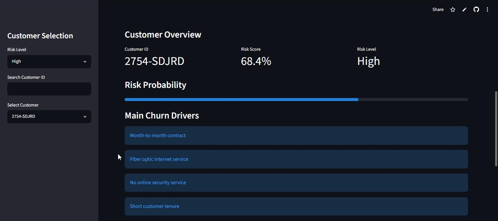
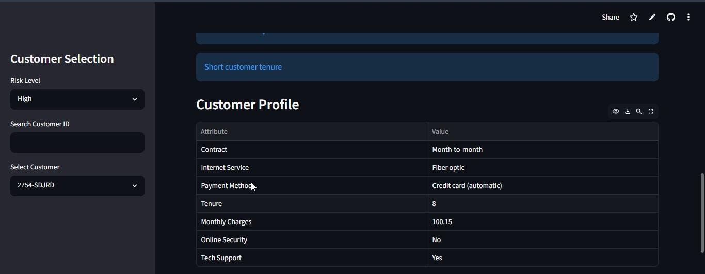
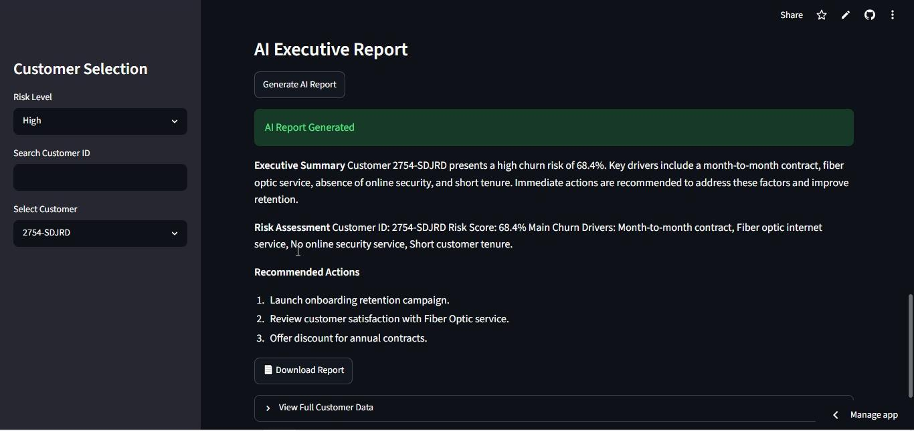

# Customer Churn Intelligence Platform

An end-to-end Customer Churn Analytics project that combines Machine Learning, Explainable AI, Business Intelligence, and Generative AI to identify customers at risk of churn and generate actionable retention recommendations.

## Live Demo

https://customer-churn-intelligence-f6qomtdncwfzzz2xknryth.streamlit.app/

---

## Project Overview

Customer churn is one of the most important business challenges in subscription-based industries.

This project predicts customer churn risk, explains the main drivers behind each prediction using SHAP, generates business recommendations, and creates executive reports using Google's Gemini AI.

The goal is to transform raw customer data into business-ready insights that decision-makers can act on.

---

## Features

### Churn Prediction

* Machine Learning model trained on customer data
* Individual customer risk scoring
* Risk classification:

  * High Risk
  * Medium Risk
  * Low Risk

### Explainable AI

* SHAP-based feature importance analysis
* Customer-level churn drivers
* Transparent model predictions

### Business Recommendations

Automatic recommendation engine that suggests retention actions based on the customer's risk factors.

Examples:

* Launch onboarding retention campaign
* Promote automatic payment methods
* Review Fiber Optic service satisfaction
* Offer annual contract incentives

### AI Executive Reports

Powered by Google Gemini.

Generates executive summaries including:

* Risk assessment
* Main churn drivers
* Recommended business actions

### Interactive Dashboard

Built with Streamlit.

Includes:

* Portfolio KPIs
* Customer search
* Top 10 high-risk customers
* Risk score visualization
* AI report generation
* Downloadable reports

---

## Dashboard Preview

### Main Dashboard



### Customer Analysis



### AI Executive Report



---

## Tech Stack

### Data Analysis

* Python
* Pandas
* NumPy

### Machine Learning

* Scikit-Learn

### Explainable AI

* SHAP

### Visualization

* Matplotlib
* Seaborn

### Web Application

* Streamlit

### Generative AI

* Google Gemini API

---

## Project Structure

customer-churn-intelligence/

├── app.py

├── requirements.txt

├── README.md

├── data/

    └── raw/

│   └── processed/

│       └── customer_risk_scoring_business.csv

├── notebooks/

│   └── eda.ipynb

│   └── feature_engineering.ipynb

│   └── modeling.ipynb

│   └── ai_churn_intellingence.ipynb

│   └── explainable_ai.ipynb

├── src/

│   ├── **init**.py

│   ├── report_utils.py

│   └── llm_report_generator.py

└── docs/

---

## Machine Learning Workflow

1. Data Preparation
2. Feature Engineering
3. Model Training
4. Churn Probability Prediction
5. Risk Scoring
6. SHAP Explainability
7. Business Recommendations
8. AI Executive Report Generation
9. Interactive Dashboard Deployment

---

## Installation

Clone the repository:

```bash
git clone https://github.com/yourusername/customer-churn-intelligence.git

cd customer-churn-intelligence
```

Install dependencies:

```bash
pip install -r requirements.txt
```

Create a .env file:

```env
GEMINI_API_KEY=your_api_key
```

Run the application:

```bash
streamlit run app.py
```

---

## Business Value

This project demonstrates how Data Analytics, Machine Learning, Explainable AI, and Generative AI can work together to support customer retention strategies.

Instead of only predicting churn, the platform provides:

* Risk assessment
* Explainability
* Business recommendations
* Executive reporting

making the output more useful for real business decision-making.

---

## Future Improvements

* Automated customer segmentation
* Churn monitoring alerts
* PDF report generation
* CRM integration
* Advanced retention simulations
* Multi-model comparison

---

## Author

Valentín Quiroga

 Data Analyst focused on Analytics, and AI-powered business solutions.
